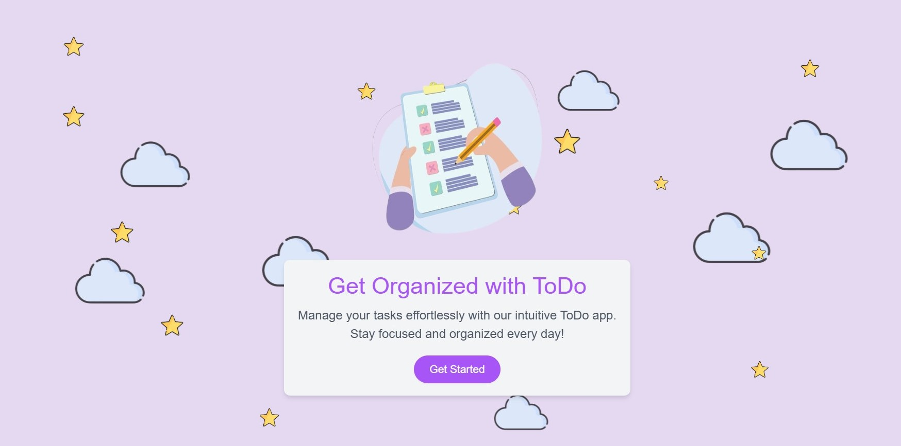
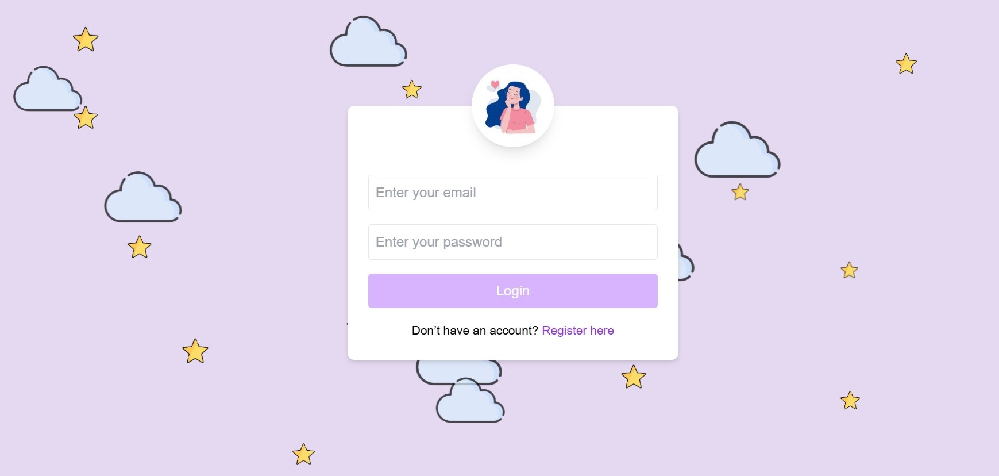
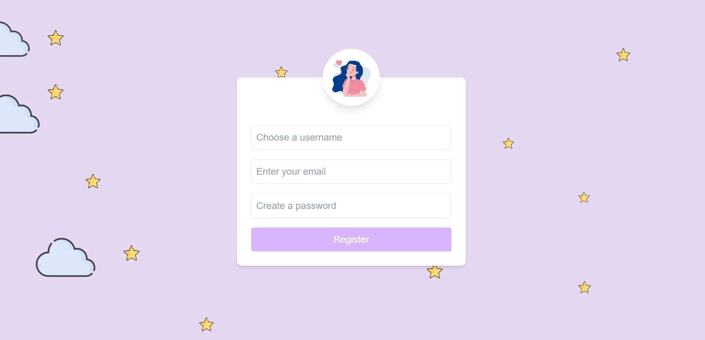
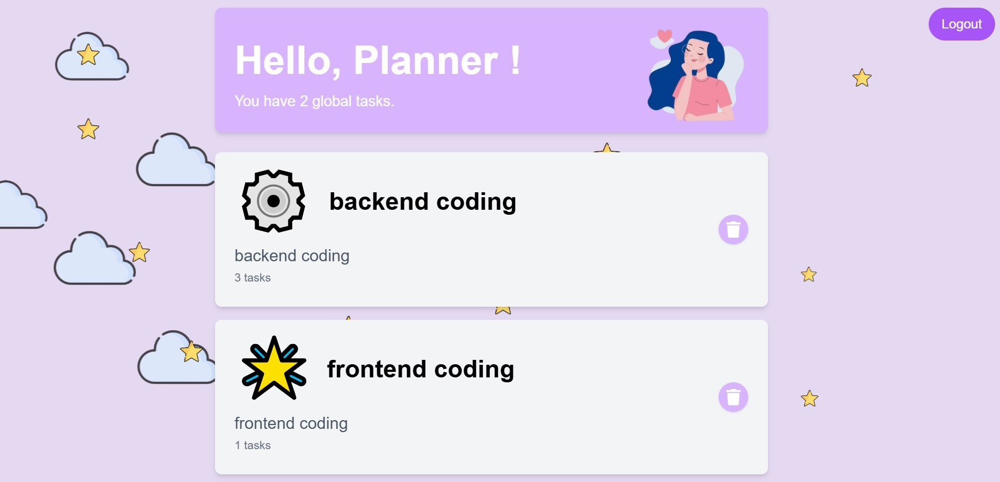
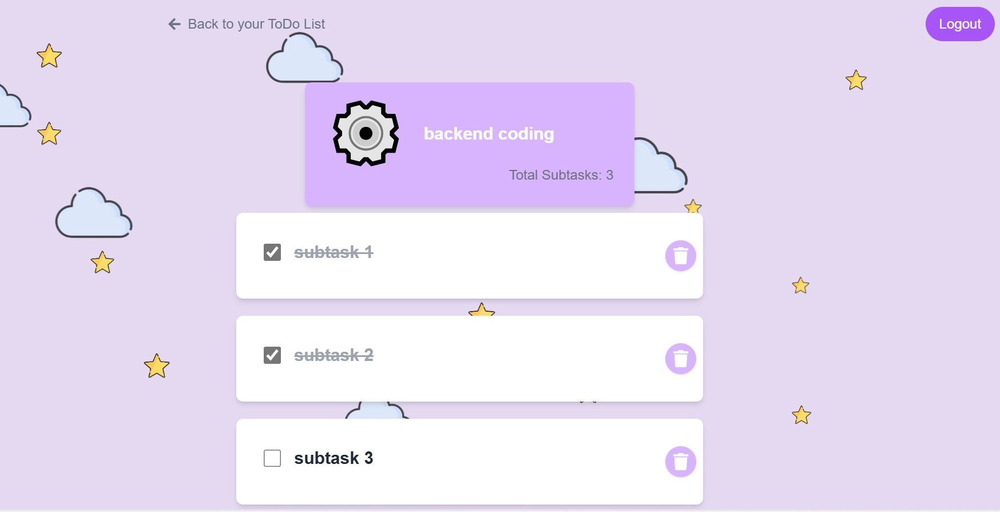

# TO DO App

## Overview
TO DO App is a web application that helps users organize and manage personal or professional tasks. Each user has a secure space to create, track, and organize main tasks and subtasks.

**Goals:**
- Plan daily activities effectively  
- Improve productivity  
- Track task progress in real time  

## Main Features

### Home Page
- Introduction to the app and its benefits  

### Login Page
- Secure input of email and password  
- Automatic redirection after successful login  

### Register Page
- Create a new user account  
- Simple and secure registration form  

### Main Tasks Page
- Display main tasks and number of subtasks  
- Add and delete tasks  
- View subtasks  
- Logout  

### Subtasks Page
- Manage subtasks associated with a main task  
- Add, delete, and mark subtasks as completed  
- Logout  

## Tech Stack
- Frontend: React, CSS, Tailwind  
- Backend: Flask  
- Storage: JSON / Local Storage  
